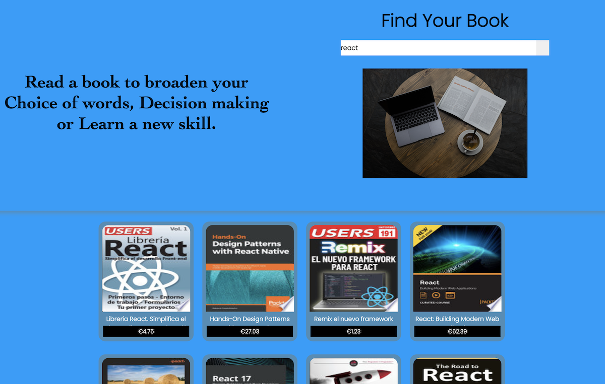

## online-bookstore
An online bookstore built using rest API, user-friendly, easy to use and good performance.
As an advocate for E-learning for all kinds of people as well as vast number of book availability. 

# status
App completed successfully with react.js and typescript, ready for production and release.

# code style
React component based method, folderize naming conventions and camelCase system of naming. Componization of code, DRY principle and inline css styling(scss)
# framework/stacks to use
react.js
google book API
javascript
typescript
scss

# screenshot

# installation
open/clone project
npm install //to install all dependencies
npm start
horaaaayy

